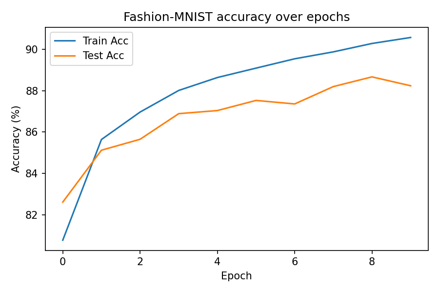

# 🧠 Fashion-MNIST Classifier (PyTorch)

A clean, minimal PyTorch project for classifying clothing images from the Fashion-MNIST dataset. Trains a simple feed-forward neural network and tracks training/test accuracy over time.

## 📈 Example Output

<p align="center">
  
</p>

## 🚀 Getting Started

```bash
git clone https://github.com/MahadSial/fashion-mnist-classifier.git
cd fashion-mnist-classifier
pip install -r requirements.txt
python train.py
